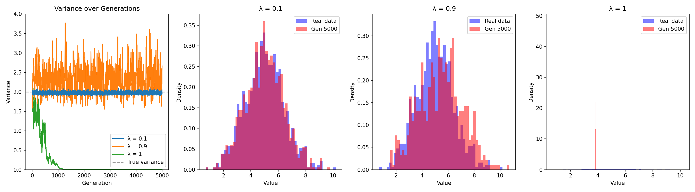

# DiffusionCollapse

> Investigating model collapse in generative models — how iterative training on synthetic data degrades output distributions.



## Overview

This project studies **model collapse**: the phenomenon where generative models progressively lose fidelity when trained on their own outputs. We start with a Gaussian Mixture Model (GMM) toy problem to build intuition, then scale to diffusion models ([EDM](https://github.com/NVlabs/edm)).

### Key Research Questions

- What is the **minimum proportion of real data** needed to prevent collapse?
- Does **data accumulation** (keeping old data) prevent collapse, while **data replacement** causes it?
- How does the synthetic-to-real data ratio affect distribution degradation over generations?

## Project Structure

```
├── diffusion_model.py         # Main EDM model-collapse experiment (lambda=1)
├── diffusion.sh               # Executable script — runs the full experiment
├── diffusion.sub              # HTCondor submit file for CHTC
├── Dockerfile                 # Container definition for CHTC jobs
├── gmm.py                     # GMM model collapse experiment
├── generate_image.py          # EDM image generation + FID calculation
├── generate_gmm_samples.py    # GMM sample generation utility
├── gmm_variance_comparison.png # Experiment output plot
├── edm/                       # NVIDIA EDM codebase (gitignored)
├── dataset/                   # CIFAR-10 training data (gitignored)
├── output/                    # EDM generated images and logs (gitignored)
└── gmm_out/                   # GMM samples and statistics (gitignored)
```

## Getting Started

### Prerequisites

- Python 3.8–3.9
- [Conda](https://docs.conda.io/en/latest/) or Docker (for CHTC)
- CUDA-capable GPU (recommended for full-scale runs)

### Installation

```bash
git clone https://github.com/alexzhangryan/DiffusionCollapse
cd DiffusionCollapse
git clone https://github.com/NVlabs/edm.git

conda create -n edm python=3.9
conda activate edm
pip install torch==1.12.1 numpy scipy pillow tqdm scikit-learn matplotlib imageio pyspng
```

### Dataset

Download CIFAR-10 and convert to EDM zip format (one-time setup):

```bash
# Download raw CIFAR-10 into dataset/
# Then convert to EDM format:
python edm/dataset_tool.py --source=dataset/ --dest=dataset/cifar10-32x32.zip

# Generate FID reference statistics (requires internet):
torchrun --standalone --nproc_per_node=1 edm/fid.py ref \
    --data=dataset/cifar10-32x32.zip \
    --dest=cifar10-32x32.npz
```

## Running the Experiment

### Locally (quick test)

```bash
./diffusion.sh --local
# Uses 200 images/generation, 1 Mimg training — completes in minutes
```

### Full scale (server / CHTC)

```bash
./diffusion.sh
# Uses 50,000 images/generation, 200 Mimg training — requires GPU
```

Results are written to `output/results.json` and `output/collapse_metrics.png`.

### On CHTC (HTCondor)

**Step 1 — Build and push the Docker container** (one-time, run locally with Docker installed):
```bash
docker build -t <dockerhub_username>/edm-experiment:latest .
docker push <dockerhub_username>/edm-experiment:latest
```
Then edit `diffusion.sub` and replace `<dockerhub_username>` with your Docker Hub username.

**Step 2 — Generate FID reference stats** (one-time, run locally before bundling):
```bash
torchrun --standalone --nproc_per_node=1 edm/fid.py ref \
    --data=dataset/cifar10-32x32.zip \
    --dest=cifar10-32x32.npz
```

**Step 3 — Bundle everything into a tarball:**
```bash
tar -czf experiment.tar.gz \
    edm/ \
    dataset/cifar10-32x32.zip \
    cifar10-32x32.npz \
    diffusion_model.py \
    diffusion.sh
```

**Step 4 — Upload to CHTC and submit:**
```bash
scp experiment.tar.gz diffusion.sub <user>@submit.chtc.wisc.edu:~/diffusion/
ssh <user>@submit.chtc.wisc.edu
cd ~/diffusion
mkdir -p logs
condor_submit diffusion.sub
```

**Step 5 — Monitor the job:**
```bash
condor_q                               # check job status
tail -f logs/job_<ClusterID>.out       # stream stdout live
```

Output files are transferred back automatically to `output/` when the job completes.

## Experiments

### GMM Collapse Experiment

`gmm.py` simulates model collapse on a 1-D Gaussian:

1. Start with `N = 1000` real samples from `N(5.0, 2.0)`
2. At each generation, fit a GMM to the current dataset
3. Replace a fraction **λ** of the data with synthetic samples from the fitted GMM
4. Track variance over 5,000 generations

**Lambda (λ)** controls the synthetic data ratio:

| λ Value | Synthetic % | Behavior |
|---------|-------------|----------|
| `0.1`   | 10%         | Variance stays near true value — stable |
| `0.9`   | 90%         | Mean preserved, but variance becomes unstable |
| `1.0`   | 100%        | Complete collapse to a point mass |

```bash
python gmm.py
```

### EDM Diffusion Model Collapse Experiment

`diffusion_model.py` scales the collapse experiment to CIFAR-10 images using the EDM framework. At each generation (λ=1, full replacement):

1. Train an EDM model on the current dataset
2. Generate 50,000 synthetic images
3. Compute pixel variance and FID vs. real CIFAR-10
4. Use the synthetic images as the next generation's training data

Metrics tracked per generation: **FID** and **pixel variance**.

## Key Findings

From the GMM experiment:

- **Pure replacement (λ = 1.0)** causes rapid, complete collapse — variance drops to zero.
- **High synthetic ratio (λ = 0.9)** preserves the mean but variance becomes unstable.
- **Low synthetic ratio (λ = 0.1)** maintains a stable distribution close to the true data.
- Even a **small fraction of real data** can anchor the distribution and prevent total collapse.

## Literature

This work builds on:

1. **"AI Models Collapse When Trained on Recursively Generated Data"** — Shumailov et al. Models amplify their own errors through recursive training.
2. **"Strong Model Collapse"** — Dohmatob et al. ([arXiv:2410.04840](https://arxiv.org/abs/2410.04840)) — Even 1% synthetic data can induce collapse; larger models may amplify it.
3. **"Is Model Collapse Inevitable?"** — Dohmatob et al. ([arXiv:2404.01413](https://arxiv.org/abs/2404.01413)) — Data accumulation prevents collapse; data replacement causes it (1/i² summability argument).
4. **"Theoretical Perspective on Mitigating Model Collapse"** — ([arXiv:2502.18865](https://arxiv.org/abs/2502.18865)) — Recursive stability and architecture choice matter for collapse resistance.

## Roadmap

- [ ] Implement data **accumulation** scenario (vs. current replacement experiment)
- [ ] Sweep over more λ values and sample sizes
- [ ] Add bias-variance decomposition metrics
- [ ] Scale experiments to EDM diffusion model
- [ ] Generate 50k+ images for reliable FID measurements

## License

This project is for research purposes. The EDM codebase is subject to [NVIDIA's license](https://github.com/NVlabs/edm/blob/main/LICENSE.txt).
